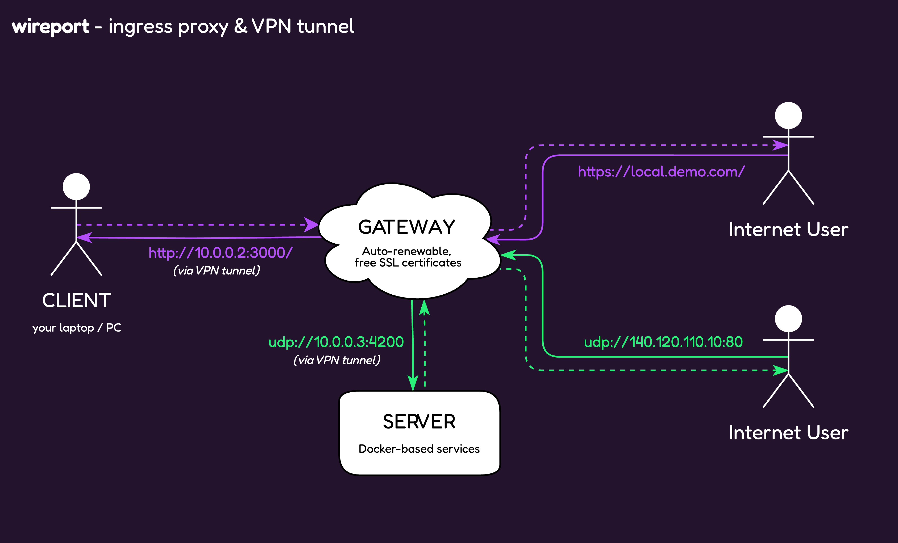
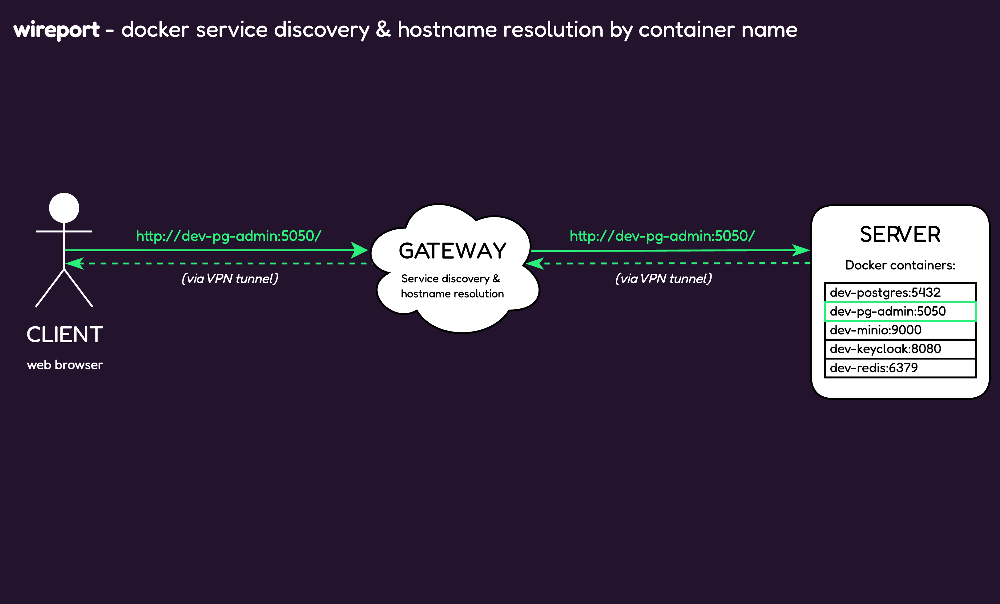

<p align="center">
  
</p>

<h1 align="center" style="color:#23132d">
  wireport
</h1>

<p align="center">
  <strong>Self-hosted ingress proxy & VPN tunnel. Securely exposes private local & Docker-based services to the Internet, with free, automatically renewable SSL certificates.</strong><br />
  Powered by WireGuard, CoreDNS and Caddy
</p>

<p align="center">
  <a href="#features">Features</a> •
  <a href="#installation">Installation</a> •
  <a href="#quick-start">Quick Start</a> •
  <a href="#security-considerations">Security</a> •
  <a href="#troubleshooting">Troubleshooting</a> •
  <a href="#sponsorship">Sponsorship</a>
</p>

---

<div align="center">

[](https://github.com/sponsors/maxskorr)  
[](https://opensource.org/licenses/MIT)
[](https://github.com/MultionLabs/wireport/releases)
[](https://github.com/MultionLabs/wireport/releases)

</div>

---

**wireport** is a self-hosted ingress proxy and VPN tunnel that securely exposes private local and Docker-based services to the Internet, with free, automatically renewable SSL certificates. Powered by WireGuard (secure networking), CoreDNS and Caddy (performant reverse proxy).

- Exposing local and Docker-based services running in a local network (e.g., on the local machine, on a corporate network, on a NAS, or on a home server) to the Internet
- Secure tunneling into remote development/staging/production environments to facilitate debugging and troubleshooting of remote Docker-based services

## Features

- SSL/TLS termination with **100% free and automated certificate provisioning and renewal**
- **Reverse proxy** with support for HTTP(S) and TCP/UDP (Layer-4) (Caddy)
- **Secure access** to internal docker-based services and admin dashboards
- **Secure VPN tunneling** (WireGuard)
- Automatic **service discovery and hostname resolution by Docker container names** (CoreDNS)
- **Multiplatform CLI** (Linux, macOS, Windows — ARM64 & AMD64)
- **Self-hosted** and **open-source**
- **High performance** with a **low memory footprint**
- [Quick and easy start](#quick-start) in self-hosted mode in just **two commands** - no tinkering with docker/compose files

## Key Concepts

- **GATEWAY** – a Linux-based machine with Docker installed, a public IP address, and the following open ports: 80/tcp, 443/tcp, 4060/tcp, 51820/udp and 32420-32421/tcp+udp. This node acts as the ingress gateway and an entry point to your published services.
- **CLIENT** – any number of laptops/PCs that will connect to the WireGuard network to manage the ingress network and expose services from their local machines to the Internet.
- **SERVER** *(optional)* – one or more Linux-based machines (with Docker) that run the workloads you want to expose. These nodes join the same private WireGuard network, provided by the GATEWAY.

|  |
|:--:|
| *wireport - ingress proxy and VPN tunnel* |

|  |
|:--:|
| *wireport - docker service discovery & hostname resolution by container name* |

## Installation


**via Homebrew (macOS, Linux)**

```bash
brew install MultionLabs/wireport/wireport
```

or

**via scoop (Windows)**

```bash
scoop bucket add wireport https://github.com/MultionLabs/scoop-wireport
scoop install wireport
```

or

**from binaries (Linux, macOS, Windows)**

<details>
<summary>Links to latest pre-built packages & unsigned binaries (Linux, macOS, Windows)</summary>

| Platform | AMD64 | ARM64 |
|:---------|:------|:------|
| **macOS (.pkg)** | [wireport-macos-amd64.pkg](https://github.com/MultionLabs/wireport/releases/latest/download/wireport-macos-amd64.pkg) | [wireport-macos-arm64.pkg](https://github.com/MultionLabs/wireport/releases/latest/download/wireport-macos-arm64.pkg) |
| **macOS (.zip)** | [wireport-macos-amd64.zip](https://github.com/MultionLabs/wireport/releases/latest/download/wireport-macos-amd64.zip) | [wireport-macos-arm64.zip](https://github.com/MultionLabs/wireport/releases/latest/download/wireport-macos-arm64.zip) |
| **Linux (.tar)** | [wireport-linux-amd64.tar](https://github.com/MultionLabs/wireport/releases/latest/download/wireport-linux-amd64.tar) | [wireport-linux-arm64.tar](https://github.com/MultionLabs/wireport/releases/latest/download/wireport-linux-arm64.tar) |
| **Linux (.deb)** | [wireport-linux-amd64.deb](https://github.com/MultionLabs/wireport/releases/latest/download/wireport-linux-amd64.deb) | [wireport-linux-arm64.deb](https://github.com/MultionLabs/wireport/releases/latest/download/wireport-linux-arm64.deb) |
| **Linux (.rpm)** | [wireport-linux-amd64.rpm](https://github.com/MultionLabs/wireport/releases/latest/download/wireport-linux-amd64.rpm) | [wireport-linux-arm64.rpm](https://github.com/MultionLabs/wireport/releases/latest/download/wireport-linux-arm64.rpm) |
| **Windows** | [wireport-windows-amd64.zip](https://github.com/MultionLabs/wireport/releases/latest/download/wireport-windows-amd64.zip) | [wireport-windows-arm64.zip](https://github.com/MultionLabs/wireport/releases/latest/download/wireport-windows-arm64.zip) |

Installing from a `.deb` package on Ubuntu or Debian (amd64):

```bash
wget https://github.com/MultionLabs/wireport/releases/latest/download/wireport-linux-amd64.deb && \
sudo dpkg -i ./wireport-linux-amd64.deb
```

Installing from an `.rpm` package on Alma or Rocky (amd64):

```bash
wget https://github.com/MultionLabs/wireport/releases/latest/download/wireport-linux-amd64.rpm && \
sudo rpm -ivh ./wireport-linux-amd64.rpm
```

Installing from a `.tar` package (e.g., on Arch; amd64):

```bash
wget https://github.com/MultionLabs/wireport/releases/latest/download/wireport-linux-amd64.tar && \
sudo tar -xvf wireport-linux-amd64.tar -C /
```

### ⚠️ Running Unsigned Binaries on macOS and Windows

Since the binaries are **not signed with commercial certificates**, your operating system may prevent them from launching by default.  
You will need to manually allow them.

---

### 🪟 On Windows

When you try to launch the program, you may see a warning similar to:

> **Windows protected your PC**  
> Windows Defender SmartScreen prevented an unrecognized app from starting.

To proceed:

1. Click **More info**.
2. Click **Run anyway**.

This will start the application despite the warning.

---

### 🍎 On macOS

When you attempt to open the app or installer, you may see:

> "**wireport** cannot be opened because the developer cannot be verified."

To allow it:

1. Open **Finder** and locate the application or `.pkg` file.
2. **Right-click** (or Control-click) the file and select **Open**.
3. You will see a similar warning, but this time it includes an **Open** button.
4. Click **Open** to confirm you trust the file.

Alternatively, you can allow the app through **System Preferences**:

1. Open **Apple Menu > System Settings > Privacy & Security > General**.
2. You will see a message that the app was blocked.
3. Click **Allow Anyway**.
4. Then, try opening the app again.

---

**Note:**
- These steps are necessary **only once per file**.
- If you have any concerns about file integrity, consider [verifying checksums](https://github.com/MultionLabs/wireport/releases) or building binaries from the source code yourself.
- In enterprise environments, administrators can whitelist the binaries using Group Policy (Windows) or Gatekeeper settings (macOS).

</details>

## Quick Start

You're **two commands** away from exposing your first service **from your local machine to the Internet**!

#### 1. Bootstrap a GATEWAY node

Run in your local terminal:

```bash
wireport gateway up sshuser@140.120.110.10:22
```

*(replace SSH username, IP, and PORT with the real details of the GATEWAY machine)*

This command outputs a WireGuard configuration -- **import it into your WireGuard client** on your CLIENT device and **activate it** before proceeding with the next command.

<details>
<summary>Sample output</summary>

```
🔒 Enter SSH password:
🚀 wireport Gateway Up
==========================

📡 Connecting to gateway...
   Gateway: sshuser@140.120.110.10:22
   Status: ✅ Connected

🔍 Checking current status...
   Status: ❌ Not Running
   💡 Proceeding with installation...

📦 Installing wireport...
   Gateway: sshuser@140.120.110.10:22
   Status: ✅ Installation Completed

✅ Verifying installation...
   Status: ✅ Verified Successfully, Running
   🎉 wireport has been successfully installed and started on the gateway!

   🔑 Applying Client Join Token: eyJpZCI6IjMxMGIyYTQz...

# # # # # # # # # # # # # # # # # # # # # # #
#       wireport config for WireGuard       #
# # # # # # # # # # # # # # # # # # # # # # #

[Interface]
Address = 10.0.0.2/24
PrivateKey = CDCH09W1+x4P+aZ3OIF2dnEhvYOms2RtV2ReIHqa/0I=
DNS = 10.0.0.1

[Peer]
PublicKey = AfYB6BMUMYDcIojecg7H5jhnDNzqIf56rXJ74md1Rw4=
Endpoint = 140.120.110.10:51820
AllowedIPs = 172.16.0.0/12, 10.0.0.1/24
PersistentKeepalive = 15

⤵ wireport WireGuard config has been dumped

   ✅ Client Join Token Applied

✨ Bootstrap process completed!
```
</details>

<details>
<summary>Advanced usage scenarios</summary>

Use SSH key with an empty passphrase and dump the WireGuard config straight to the file:

```bash
wireport gateway up sshuser@140.120.110.10:22 --ssh-key-path ~/.ssh/id_rsa --ssh-key-pass-empty > ~/path/to/wireguard-config.conf
```

</details>

<details>
<summary><strong>Important – firewall and other prerequisites</strong></summary>

`wireport gateway up` expects that:

1) the following ports must be reachable on the target GATEWAY machine *before* you run the command:

* 22/tcp (SSH)
* 80/tcp and 443/tcp (HTTP/HTTPS)
* 4060/tcp (Wireport control channel)
* 51820/udp (WireGuard)
* 32420-32421/tcp+udp (reserved ports for exposing services with wireport)

Example with UFW:

```bash
sudo ufw allow 22,80,443,4060/tcp
sudo ufw allow 51820/udp
sudo ufw allow 32420:32421/tcp
sudo ufw allow 32420:32421/udp
sudo ufw enable
```

2) Docker is installed on the target GATEWAY machine
3) The account used for SSHing into the target GATEWAY machine has all the necessary permissions for managing Docker containers, images, and networks
</details>

<details>
<summary>wireport <strong>DOES NOT</strong> store SSH credentials</summary>

wireport relies on [goph](https://github.com/melbahja/goph) for handling SSH connections and executing commands on the target remote machines. The credentials are **never stored** by wireport and they only stay in the memory of your client device for the time of executing the commands (typically, a few seconds).
</details>

#### 2. Expose a local service to the Internet

Run in your local terminal:

```bash
wireport service publish \
  --local  http://10.0.0.2:3000 \
  --public https://demo.example.com:443
```
(assuming `10.0.0.2` is the IP address of your CLIENT device in wireport network & there is a DNS A-record for the domain `demo.example.com`, pointing to your GATEWAY node's IP address)

🎉 **Congratulations!** Your first local service running on port 3000 is now securely accessible on the Internet at `https://demo.example.com/`. wireport automatically generates and renews SSL certificates for your domain.

<details>
<summary>Command and flags explained</summary>

This command supports different protocols (HTTP, HTTPS, TCP, UDP) and automatically provisions a free SSL certificate for the domain when an HTTPS-based URL with a domain name is specified in the **--public** parameter, provided that a correct A-record is set up in your domain provider's DNS settings and points to the GATEWAY machine.

* **--local** – address of the service **on the machine where you run the command** (or another CLIENT/SERVER node from the wireport-managed WireGuard network)
* **--public** – External protocol / hostname / port that will be reachable on the GATEWAY

If a service is supposed to be exposed using the public IP of the gateway node (e.g., to be available on `140.120.110.10`), don't specify the public IP itself in **--public** argument, but use `0.0.0.0` instead (e.g., **tcp://0.0.0.0:32420**)
</details>

<details>
<summary><strong>Important - DNS config and other prerequisites</strong></summary>

1) For the service to become available over the given public URL, there must be a respective `A`-record in the DNS settings of your domain name provider, pointing to the target **GATEWAY** machine's IP address.

2) After bootstrapping the GATEWAY node with the `wireport gateway up ...` command, you should add the respective WireGuard tunnel on your local machine

3) There must be a service running and accessible at the address specified in the `--local` flag provided to the `wireport service publish` command (this can be on any CLIENT or SERVER node in the wireport-managed WireGuard network)

4) The following ports are available for exposure on the GATEWAY machine (public URL of the exposed service): 80, 443

</details>

---

## Other useful commands

| Purpose | Command |
|:--------|:--------|
| Remove a public endpoint | `wireport service unpublish -p https://demo.example.com:443` |
| Adjust headers/timeouts | `wireport service params new -p https://demo.example.com:443 --param-value 'header_up X-Tenant-Hostname {http.request.host}'` |
| Create more CLIENTs | `wireport client new` |
| Add a workload SERVER | `wireport server up sshuser@140.120.110.10` |
| Tear down a SERVER | `wireport server down sshuser@140.120.110.10` |
| Tear down a GATEWAY | `wireport gateway down sshuser@140.120.110.10` |

Refer to `wireport --help` for the full CLI reference.

## Security Considerations

- The gateway container runs with privileged access for network configuration
- All traffic is encrypted using WireGuard
- Control traffic is encrypted (TLS)
- HTTPS is configurable for secure web access to exposed services

## Troubleshooting

If you encounter issues:
1. Check service logs: `docker logs wireport-gateway` or `docker logs wireport-server`
2. Verify firewall status & make sure all required ports are open
3. Check status of the WireGuard network inside the GATEWAY and SERVER wireport containers using `wg show` and other WireGuard commands
4. Check pingability of private services from inside GATEWAY, SERVER and CLIENT nodes
5. If a private service is not reachable, make sure the container is running and check its logs; check whether the target container (in case of the SERVER workloads) is attached to the `wireport-net` Docker network (wireport agent manages this automatically).

<details>
<summary>Test commands for TCP & UDP forwarding</summary>

For testing UDP forwarding, on the SERVR node run:

```bash
docker run --rm -d --name udp-server alpine sh -c "apk add --no-cache socat && socat -v UDP-RECV:3000 STDOUT"
```

- this command will start a docker container, called `udp-server`.

Now, send some test UDP packets from your CLIENT device, e.g.:

```bash
echo "hello via UDP" | nc -u 10.0.0.3 3000
```
(for a test inside the wireport network)

or

```bash
echo "hello via UDP" | nc -u 140.120.110.10 32420
```
(for a test, involving publicly exposed services, e.g. `wireport service publish --public udp://0.0.0.0:32420 --local udp://udp-server:3000` or so)

The logs of `udp-server` container on your SERVER node should log the test data.

For testing UDP forwarding, on the SERVER node run:

```bash
docker run --rm -d --name tcp-server alpine sh -c "while true; do nc -lk -p 3000; done"
```

- this command will start a docker container, called `tcp-server`.

Now, send some test TCP packets from your CLIENT device, e.g.:

```bash
echo "hello via TCP" | nc 10.0.0.3 3000
```
(for a test inside the wireport network)

or

```bash
echo "hello via TCP" | nc 140.120.110.10 32420
```
(for a test, involving publicly exposed services, e.g. `wireport service publish --public tcp://0.0.0.0:32420 --local tcp://tcp-server:3000` or so)

The logs of `tcp-server` container on your SERVER node should log the test data.

</details>

## Sponsorship

If you find this project useful, please consider [sponsoring the development via GitHub](https://github.com/sponsors/maxskorr). Thank you!

## License

[MIT](LICENSE.txt)

## Contributing

Contributions are welcome! Please feel free to submit a Pull Request.
